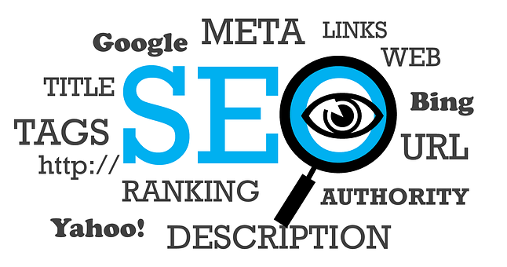
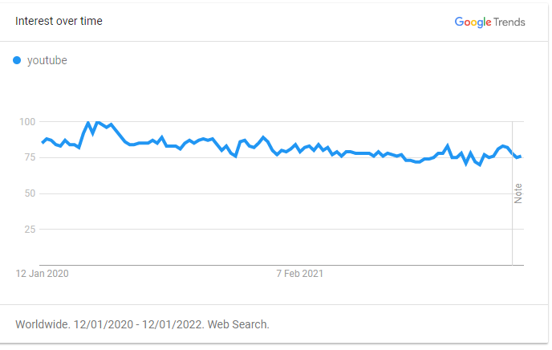
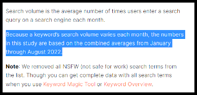
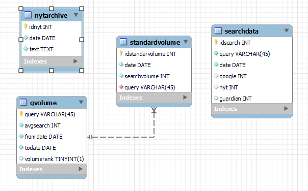

# A Simple Keyword Research Tool



## Table of contents

1. <a href="#section-1">Background</a>
2. <a href="#section-2">About this repository</a>
3. <a href="#section-3">Objectives</a>
4. <a href="#section-4">Installation and requirements</a>
5. <a href="#section-5">Limitations</a>
6. <a href="#section-6">How it works?</a>
    - <a href="#section-6a">Data Acquisition</a>
    - <a href="#section-6b">Data Processing</a>
    - <a href="#section-6c">Data Storage</a>
    - <a href="#section-6d">Machine Learning</a>
7. <a href="#section-7">Future Improvements</a>

<h2 id="section-1">Background</h2>

To design a good SEO strategy, access to big amounts of data is essential. However, access to quality data is getting harder and harder.

At the present moment, SEO tools available are expensive or offer low-quality data.

<h2 id="section-2">About this repository</h2>

This repository was created as a final project for a Data Analyst Bootcamp at Ironhack.

<h2 id="section-3">Objectives</h2>

**1. Proof of concept**: 

Design a minimum working application for SEO keyword research with a limited time (around a week) and 0 budget.

**2. Easy to deploy application**: 

Design an application that can be deployed online by anyone with only few commands.

**3. Prove that news can be a good predictor of search behavior abnormalities**: 

The search behavior of the users is usually predictable and easy to forecast. However, sometimes there are sudden spikes in searches that affect the quality of the prediction models.

This project pretends to show that we can combine, data extracted from the news and the historical behavior of the users, to improve the quality of the prediction models.

You can see a working version of this repository in [this url](https://sborto86-final-project-main-7vdvv7.streamlit.app/).

<h2 id="section-4">Installation and requirements</h2>

To deploy this application you should have to meet some minimum requirements.

<h3>Requirements</h3>

1. A server with MySQL (or similar) installed and about 100Mb available.
2. The Guardian API access key. Can be  [easily obtained here](https://open-platform.theguardian.com/access/) for free.
3. The New York Times API Key. Can be  [easily obtained here](https://developer.nytimes.com/apis) for free.

<h3>Installation</h3>

1. Open the terminal and clone the repository

```console
git clone https://github.com/sborto86/final-project
```

2. Create a .streamlit directory and an inside a file called secrets.toml

```console
mkdir .streamlit
touch ./.streamlit/secrets.toml
```

3. Open the secrets.toml file and add the necessary keys for the application to work in the following format

```
THE_GUARDIAN = "<The Guardian API key>"
NYT = "<The New York Times API key>"
SQLHOST = "<SQL server host address>"
SQLUSER = "<SQL database user name>"
SQLPW = "<SQL database pasword>"
SQLPORT = "<SQL port>"
SQLDB = "<name of the SQL database>"
```

4. Create the standards that are going to be used to estimate google search volume (it can take around 15 minutes). This should create also the SQL database automatically. In the console execute the following python script. 
```console
python ./db/standards_db.py
```

5. Create the database and the New York Times archive (it can take around 10 minutes). In the console execute the following python script:

```console
python nyarchive.py
```

6. Now that everything is ready the application can be tested locally.  In the console execute streamlit:

```console
 streamlit run main.py
```

7. Finally to deploy the application online, just follow the [instructions here](https://docs.streamlit.io/streamlit-cloud/get-started/deploy-an-app)

<h2 id="section-6">Limitations</h2>

Most of the limitations of this application come from the difficulty of getting good and reliable data

1. **News are only extracted from only two sources**, The Guardian and The New York Times

2. **Google search data is global**, regional data is not abaviable

3. **The application is optimized for English keywords**, other languages can be used, but the predictions will have a higher degree of inaccuracy.

4. **Low search keywords will not generate results**,  the estimated lower limit of detection is about 1.000 - 2.000 searches per day.

5. **Only short keywords are accepted** , maximum 3 words lengh are accepted.

6. **The data acquisition might be slow**, 3 - 5 minutes per new  keyword.

7. **The historical data is limited to two years**

8. **Google might block the request**, the acquisition of data requires multiple calls to the google trends website that might trigger the firewall.

9. **Search volume values are estimations**

<h2 id="section-6">How it works?</h2>


*A simple schema of the application structure*  

<h3 id="section-6a">Data acquisition</h3>

Sources of data used in this application:


1. **Google Trends**: Web scrapping using the library pytrends.


2. **The Guardian**: Live API calls.


3. **The New York Times**: News archives of the last two years are stored in the database, and the missing data will be updated (if necessary) in every call.


<h3 id="section-6b">1. Data Processing</a>
<h4>1. Getting Google trends data</h4>
            
**First let's see what google trends offers us**:



The information that we obtain is only a weekly average relative to the maximum 

<h4>2. From relative data to absolute data</h4>

To convert from relative to absolute data, the information provided by Semrush (one of the most renowned SEO tools) was used.  


You can read the full article by [clicking here](https://www.semrush.com/blog/most-searched-keywords-google/)

The information we get from this article is the average monthly search of the term "youtube" from January through August 2022 (see bellow):



<h4>3. Creating standards</h4>

Then with this information, we get an array of keywords from high-volume search keywords to reach the limit of detection of Google Trends:


Finally, by performing successive pair comparisons we obtain an estimation of the absolute search volume of each keyword:


Once these standards are created, we can proceed to extrapolate the absolute volume data of any keyword.

<h4>4. Getting the historical data</h4>
To get the calculated absolute search volume of a new keyword, the following process is going to performed:

1. **Find the most silimar standard**: By comparing each standard and the keyword in Google Trends we get the standard that have a similar search volume than the keyword.

2. **Convert the relative volume to absolute volume**: We use the standard to extrapolate the keyword search volume.

3. **Retrive the historical data**: Once we have the search volume from the window of the standards (January to August 2022), we get the last two years historical data for the keyword from Google Trends (relative data). 

4. **Obtain the absolute historical data** : Finally we use the absolute data obtained in the second step to calculate the historical data.
            
For example if search for "pizza" we get the following result:


Now that we have the google historical data we can proceed to scrape the newspapers (The Guardian and The New York Times)

The process is simple we check the number of news published every day that the keyword is found in the headline or the summary. 

Using the same example as before we obtain something like this:


<h4>5. Getting everything toghether</h4>

After putting all the data together, we are ready to proceed to the next step, forecasting.

But first, let's see another example, if we search for Covid-19:


As we can see here there is a good correlation between the peaks of news published and the peaks of the searches in google.

Looks like we are on the right track...

<h3 id="section-6c">Data Storage</h3>

All the extracted and processed data is stored in a simple SQL database. The schema is shown below:



<h3 id="section-6d">Machine Learning</h3>


In order, to fit our data into a model and perform forecasting the Facebook Prophet algorithm is used. There are sevral reasons to choose this algorithm, the main reasons are exposed bellow:

1. **It is fast**: We need a model that don't delay to much the processing time as the web scrapping process is already slow.

2. **It is less sensible to outliers than other models**: Compare to other predictive models is less to abnormal peaks in search volume (outliers)

3. **Good predicting yearly and weekly seasonability**: The algorithm was designed specially to predict seasonability,

4. **Can ignore periods of data**: This is one of the most important features to choose this model. As we want to exclude the periods where peaks are detected on news.

But let's see one example, if we search for Ukraine we obtain the following results:


<h2 id="section-7">Future Improvements</h2>

1. **Improve speed**:  Implement asynchronous calls by modifying the pytrends library to work with threads and use a random IP from a proxy list (to avoid being blocked by google).

2. **Improve integrity**: The code has been written with a limited amount of time and might need some debugging processes.

3. **Include other sources of data** to get better search estimations and trends from the news.         


